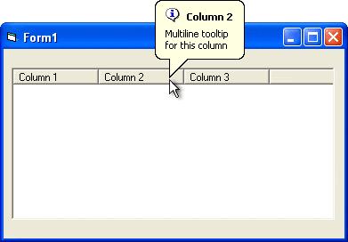



## Adding multiline balloon tooltips to ListView column headers \(updated\)

### Description

The code uses subclassing technique to trap the WM_MOUSEMOVE event of the Header control which is a constituent part of the ListView control. The handler for this event determines the index of the column header under the mouse pointer and changes the tooltip text respectively; it uses the HDM_HITTEST message for this purpose.

To find the handle of the Header control inside ListView from MSCOMCTL.OCX, the code uses the FindWindowEx function which searches for the child window with the "msvb_lib_header" class inside the ListView control.
 
### More Info
 
The code also can be used to subclass the "pure" ListView control (its class name is "SysListView32"); to do it, you must replace the "msvb_lib_header" string on "SysHeader32".

The sample creates MS Windows tooltips with the CreateWindowEx function passing to this function the "tooltips_class32" class name. Balloon tooltips work only in Windows 2000/XP; in the previous versions of Windows you'll see old-style rectangular tooltips.

You can use this technique to create multiline balloon tooltips for any control that contains Windows Header control. For instance, we use this technique to create such tooltips for the grid control we produce (10Tec iGrid ActiveX control - visit www.10Tec.com for more info).

             |
---                |---
**Submitted On**   |2003-03-25 20:41:36
**By**             |[10Tec Company](https://github.com/Planet-Source-Code/PSCIndex/blob/master/ByAuthor/10tec-company.md)
**Level**          |Intermediate
**User Rating**    |5.0 (50 globes from 10 users)
**Compatibility**  |VB 4\.0 \(32\-bit\), VB 5\.0, VB 6\.0, VBA MS Access, VBA MS Excel
**Category**       |[Windows API Call/ Explanation](https://github.com/Planet-Source-Code/PSCIndex/blob/master/ByCategory/windows-api-call-explanation__1-39.md)
**World**          |[Visual Basic](https://github.com/Planet-Source-Code/PSCIndex/blob/master/ByWorld/visual-basic.md)
**Archive File**   |[Adding\_mul1576104192003\.zip](https://github.com/Planet-Source-Code/10tec-company-adding-multiline-balloon-tooltips-to-listview-column-headers-updated__1-44312/archive/master.zip)

